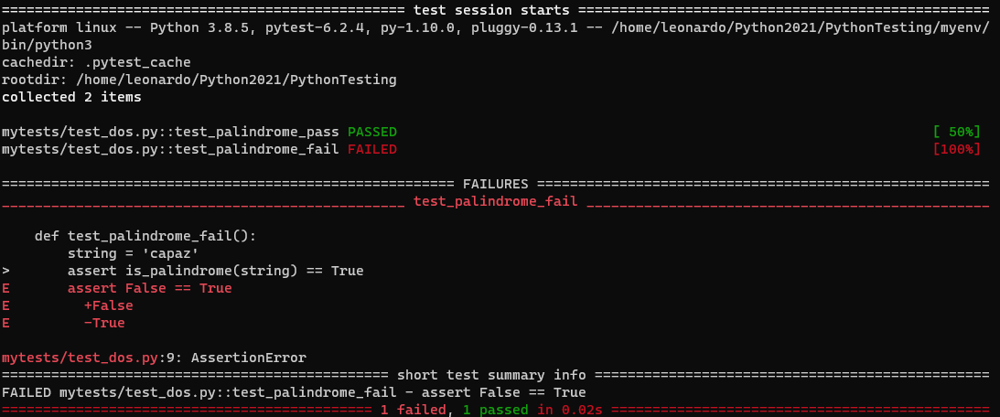
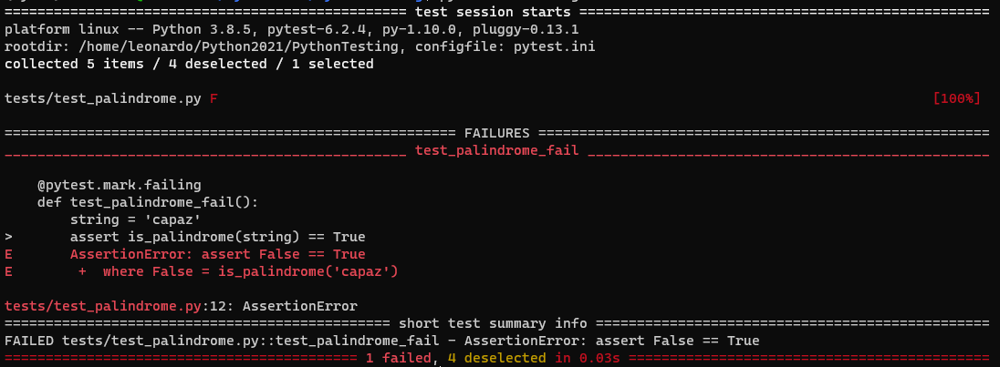

# pytest

### File organization:

Use venv and pip to install pytest.
In order to call the testable functions from the test folder we need to convert the src file into a package with the help of the file setup.py

```
setup.py
src/
    __init__.py
    palindrome.py
tests/
    test_palindrome.py
```

The file setup.py contains:
```python
from setuptools import setup, find_packages

setup(name="src", packages=find_packages())
```
Then to install the "src" package we run:
```
pip install -e .
```

```python
def is_palindrome(s):
    return s == s[::-1]
```

```python
from src.palindrome import is_palindrome

def test_palindrome_pass():
    string = 'capac'
    assert is_palindrome(string) == True

def test_palindrome_fail():
    string = 'capaz'
    assert is_palindrome(string) == True
```

Run tests:
```bash
pytest tests/test_palindrome.py
```

Use the verbose option:
```bash
pytest -v tests/test_palindrome.py
```


Possible outcomes for a test:

1) PASSED (.)
2) FAILED (F)
3) SKIPPED (s)
4) xfail (x)
5) XPASS (X)
6) ERROR (E)

Run only one test:
```
pytest tests/test_palindrome.py::test_palindrome_pass
```

Use --collect-only to check what tests are going to be executed but not to run them
```
pytest --collect-options tests/test_palindrome.py
```

Use -k to run tests that have a common preffix or suffix
```
pytest -k "pass or fail" tests/
```

## Marking the tests with a decorator

```python
import pytest
from src.palindrome import is_palindrome

@pytest.mark.passing
def test_palindrome_pass():
    string = 'capac'
    assert is_palindrome(string) == True

@pytest.mark.failing
def test_palindrome_fail():
    string = 'capaz'
    assert is_palindrome(string) == True
```

Run the marked function or functions with the command option -m. We have first to register the marks in ta file called pytest.ini which should have this content:

```python
[pytest]
markers =
    passsing: marks tests as passing
    failing: marks tests as failing
```

Running the command:
```
pytest -m passing
pytest -m failing
```
Output for failing test:

